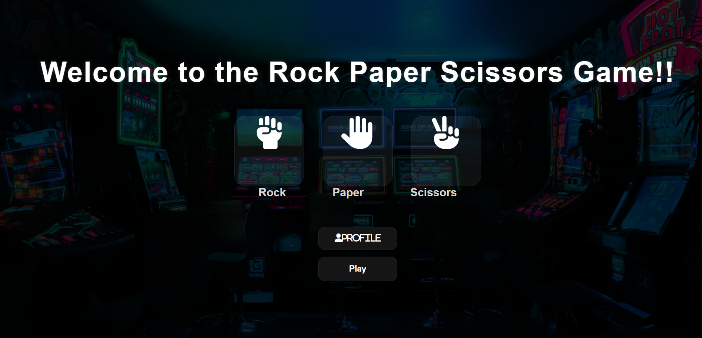

# RPS-Game
This is a playground to play rock paper and scissors with computer.
An interactive and visually appealing **Rock Paper Scissors Game** built using **HTML, CSS, and JavaScript**.

This project includes:
- A stylish landing page
- A complete gameplay arena
- Live score tracking
- Responsive modern UI
- Computer-generated random moves

---
# Live Link
 https://meghana413.github.io/RPS-Game/
# 🚀 Features

- ✊ Rock, ✋ Paper, ✌️ Scissors gameplay
- 🤖 Computer opponent with random choices
- 📊 Live scoreboard
- 🎨 Modern gaming UI
- 🌌 Responsive design
- ⚡ Smooth hover animations
- 🖥️ Separate landing and playground pages

---

# 🛠️ Technologies Used

- HTML5
- CSS3
- JavaScript
- Font Awesome Icons

---

# 📂 Project Structure

```bash
📁 rock-paper-scissors-game
│
├── index.html
├── style.css
├── playground.html
├── playground.css
├── README.md
│
└── assets
    └── rpspic.png
```

---

# 📷 Project Preview



---

# ⚙️ How It Works

1. Open the game landing page.
2. Click the **Play** button.
3. Choose:
   - Rock
   - Paper
   - Scissors
4. Computer randomly selects a move.
5. Winner is displayed instantly.
6. Scoreboard updates automatically.

---

# 🎯 Game Rules

- Rock beats Scissors
- Scissors beats Paper
- Paper beats Rock

If both choices are same:
- It's a Tie

---

# 🧠 Concepts Used

- DOM Manipulation
- Event Handling
- JavaScript Functions
- Arrays
- Random Number Generation
- Responsive Web Design
- CSS Flexbox
- Hover Animations

---

# 💡 Future Improvements

- Add sound effects
- Add multiplayer mode
- Add difficulty levels
- Add game history
- Add dark/light theme toggle

---

# 👨‍💻 Author

Made by Meghana Palavalasa
